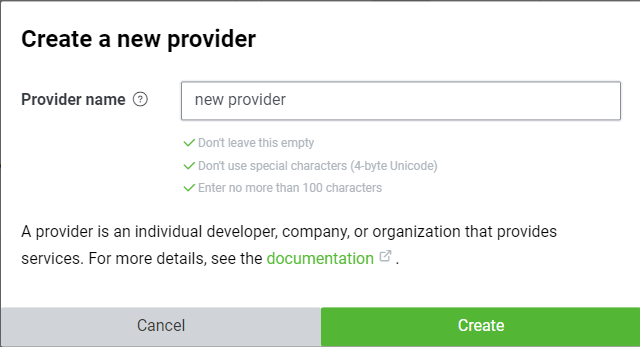
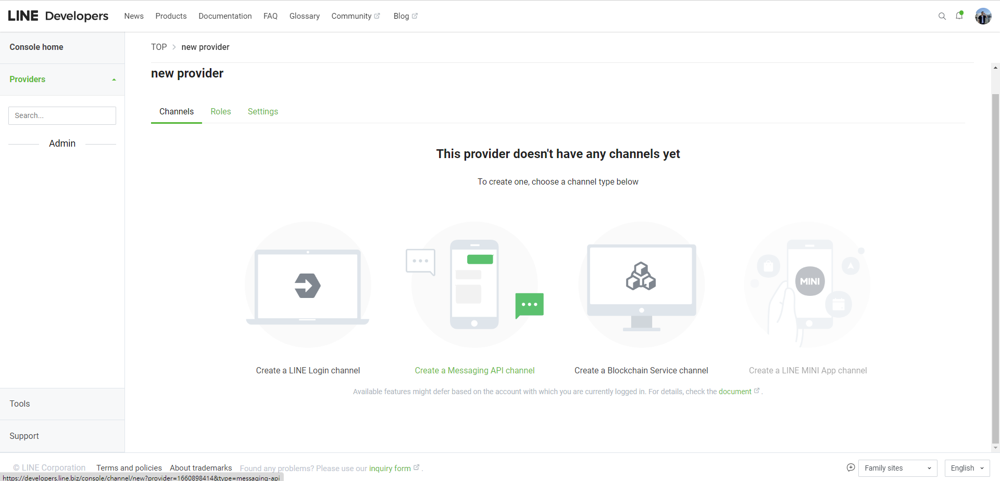
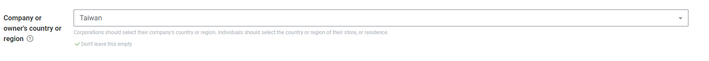
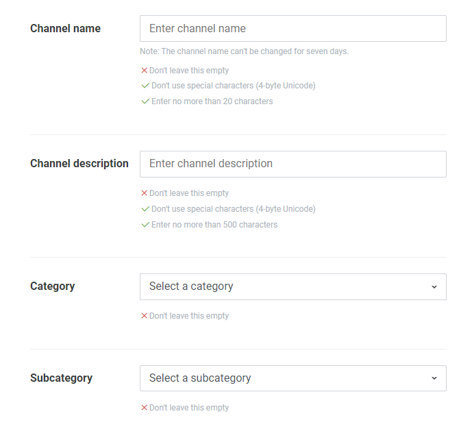
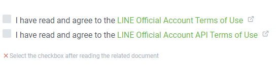
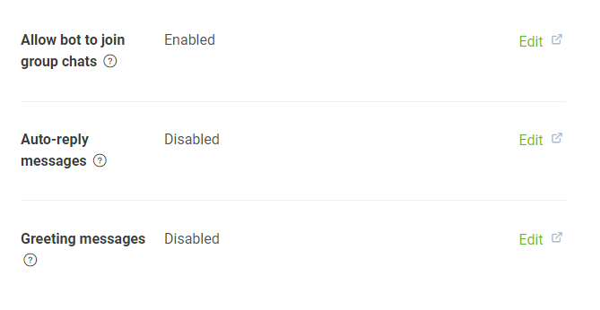
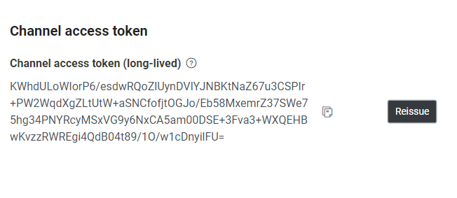
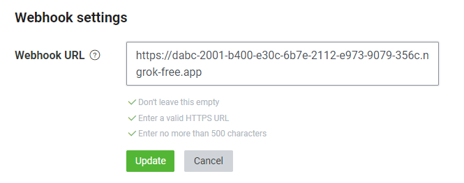

# Line Bot Group Log

## 使用方法
1. 進去 [Line develpo](https://developers.line.biz/en/) 官網，然後登入Line帳號。
   1. Create a new provider
   
   
   2. Create a Messaging API channel 
   
   
   3. Company or owner's country or region
   
   
   4. Channel name、Channel description、Category、Subcategory
   
   
   5. I have read and agree to the LINE Official Account Terms of Use 、I have read and agree to the LINE Official Account API Terms of Use 
   
   
 
2. TOP > new provider > Channel name > Messaging API > LINE Official Account features



3. TOP > new provider > Channel name > Messaging API > Channel access token 

設定 config.ini 


4. 下載 ngrok

https://ngrok.com/

5. TOP > new provider > Channel name > Messaging API > Webhook settings

產生 webhook 並貼上
```
ngrok http 5000
```


6. 運行 main.py